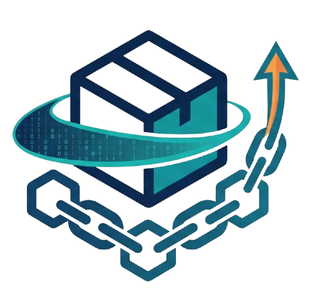
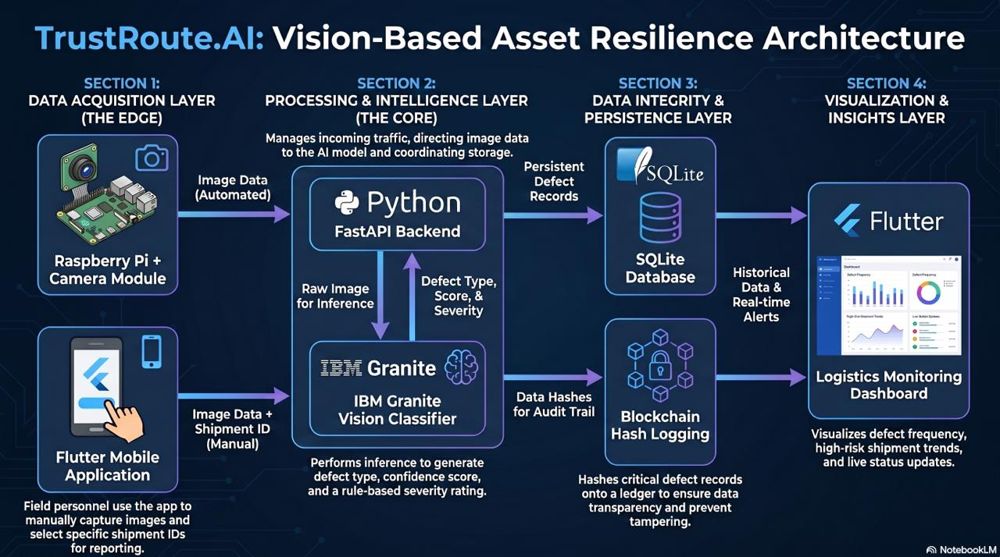
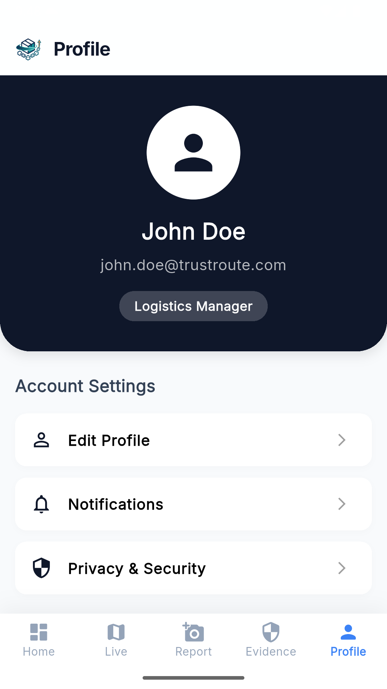

# TrustRoute.Ai

<p align="center">
  
</p>

TrustRoute.Ai is an image-first delivery defect detection MVP for logistics workflows. It analyzes delivered goods such as parcels, vehicles, and other shipment items, stores the report in the backend, and can anchor compact proof data to an Ethereum Sepolia smart contract.

The current MVP uses still images. The planned hardware flow is a Raspberry Pi with an HD camera that first sends captured images to the backend, then later upgrades to video streaming by sampling frames from the camera feed.

## Current Scope

- Upload an image of a delivered item.
- Classify visible condition or damage with IBM Granite Vision.
- Store the defect report in SQLite.
- Return the result to the Flutter mobile app.
- Optionally anchor important report details to Sepolia.
- Issue delivery certificates when the recipient receives the goods.
- Show defect history and blockchain status in the app dashboard.

## Screenshots

### System Architecture



### Mobile App Flow

| Login | Dashboard | Defect History | History Detail |
| --- | --- | --- | --- |
|  |  |  |  |

| Report Defect | Defect Detected | Defect Details |
| --- | --- | --- |
|  |  |  |

| Normal Result | Normal Details | Profile |
| --- | --- | --- |
|  |  |  |

### Monitoring And Blockchain Evidence

| Route Map | Damage Alert | Blockchain Evidence |
| --- | --- | --- |
|  |  |  |

### Sepolia Explorer Verification


## Repository Structure

```text
SLT/
  backend/      FastAPI server, AI inference, SQLite storage, blockchain calls
  blockchain/   Solidity smart contract and deployment notes
  hardware/     Raspberry Pi camera hardware documents
  mobile_app/   Flutter mobile application
```

## Backend Setup

From the backend folder:

```powershell
cd backend
python -m venv .venv
.\.venv\Scripts\Activate.ps1
pip install -r requirements-dev.txt
pip install -r requirements-vlm.txt
```

Run with IBM Granite Vision:

```powershell
$env:SLT_CLASSIFIER_BACKEND = "granite"
$env:SLT_GRANITE_MODEL_ID = "ibm-granite/granite-vision-3.2-2b"

uvicorn app.main:app --host 0.0.0.0 --port 8000
```

Open:

- API health: `http://127.0.0.1:8000/health`
- API docs: `http://127.0.0.1:8000/docs`

For phone testing on the same Wi-Fi network, use:

```text
http://<server-device-lan-ip>:8000
```

## Smart Contract Interaction

The backend can call the deployed `DefectReportRegistry` contract after prediction and for delivery certificate issuance.

Sepolia chain ID:

```text
11155111
```

Set these before starting the backend:

```powershell
$env:ETH_RPC_URL = "https://ethereum-sepolia-rpc.publicnode.com"
$env:ETH_PRIVATE_KEY = "YOUR_BACKEND_WALLET_PRIVATE_KEY"
$env:ETH_CHAIN_ID = "11155111"
$env:DEFECT_REGISTRY_ADDRESS = "0xA93F08342849139c96e6ac26C757259968edcF14"
$env:SLT_AUTO_ANCHOR_REPORTS = "true"
```

Important:

- Do not commit private keys.
- The backend wallet must have Sepolia ETH for gas.
- The backend wallet must be authorized in the contract with `setReporter(walletAddress, true)`.
- If blockchain settings are missing, prediction still works and reports return a blockchain status such as `not_configured`.

## Test Prediction

PowerShell:

```powershell
$form = @{
  shipment_id = "SHIP-TEST-001"
  image = Get-Item "C:\path\to\image.jpg"
}

Invoke-RestMethod `
  -Uri "http://127.0.0.1:8000/predict" `
  -Method Post `
  -Form $form
```

Expected response includes the classification result, confidence, report details, and blockchain fields such as:

```json
{
  "defect_type": "damaged parcel",
  "confidence": 0.91,
  "blockchain_status": "submitted",
  "blockchain_tx_hash": "0x..."
}
```

## API Endpoints

- `GET /health` - server health check
- `GET /classes` - compatibility endpoint for defect classes
- `POST /predict` - upload image, classify defect, store report, optionally anchor on-chain
- `GET /reports` - list report history
- `GET /reports/{report_id}` - get one report
- `GET /reports/{report_id}/blockchain` - preview blockchain payload for a report
- `POST /reports/{report_id}/blockchain/anchor` - submit or retry report anchoring
- `POST /delivery-certificates` - create a recipient delivery certificate
- `GET /delivery-certificates/{certificate_id}` - get one delivery certificate
- `GET /delivery-certificates/{certificate_id}/blockchain` - preview certificate blockchain payload
- `POST /delivery-certificates/{certificate_id}/blockchain/issue` - issue certificate on-chain

## Mobile App

The Flutter app lives in `mobile_app/`.

```powershell
cd mobile_app
flutter pub get
flutter run
```

The app should call the backend using the server LAN IP when testing on a physical phone.

Example:

```text
http://192.168.1.25:8000
```

The backend response is designed for the app to display:

- shipment ID
- detected defect or normal condition
- confidence
- explanation
- item type
- damage location
- report history
- blockchain transaction status

## Raspberry Pi Flow

Current MVP:

```text
Raspberry Pi HD camera -> captured image -> POST /predict -> AI result -> backend report -> mobile app
```

Future video stream flow:

```text
Raspberry Pi HD camera -> video stream -> sampled frames -> POST /predict -> AI result -> dashboard/history
```

Hardware notes are in `hardware/` and backend integration notes are in `backend/docs/raspberry_pi_integration.md`.

## Verification

Backend tests:

```powershell
cd backend
.\.venv\Scripts\Activate.ps1
python -m pytest -q
```

Flutter tests:

```powershell
cd mobile_app
flutter test
```

## More Documentation

- Backend guide: `backend/README-server.md`
- Granite Vision notes: `backend/docs/granite_vision_classifier.md`
- Mobile API contract: `backend/docs/mobile_api_contract.md`
- Blockchain notes: `blockchain/README.md`
- Solidity contract: `blockchain/contracts/DefectReportRegistry.sol`
